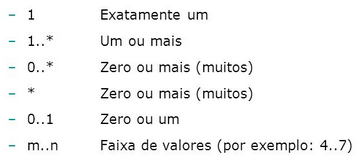
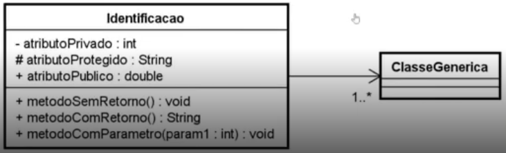

# PooJava

## Linguagem de Baixo e Alto nível

- Linguagem de Baixo Nível:
  - São linguagens que têm uma correspondência direta com a arquitetura do hardware do computador.
  - Geralmente, são usadas para escrever códigos que estão mais próximos do nível de máquina.
  - Exemplos incluem Assembly e linguagens de máquina.
  - Permitem um controle muito preciso sobre o hardware do computador, mas são mais difíceis de entender e usar do que as linguagens de alto nível.

- Linguagem de Alto Nível:
  - São linguagens que são mais próximas da linguagem humana e menos dependentes da arquitetura específica do hardware.
  - 
  - Permitem que os programadores expressem algoritmos e lógica de programação de forma mais clara e concisa.
  - Exemplos incluem Java, Python, C++, entre outras.
  - São mais fáceis de aprender e usar em comparação com as linguagens de baixo nível, mas podem ser menos eficientes em termos de desempenho em comparação com o código escrito em linguagens de baixo nível.

Em geral, linguagens de baixo nível oferecem maior controle sobre o hardware do computador, enquanto linguagens de alto nível oferecem maior produtividade e facilidade de desenvolvimento. A escolha entre linguagens de baixo e alto nível depende das necessidades específicas do projeto, dos recursos disponíveis e das preferências dos desenvolvedores.

## Programação estruturada

A programação estruturada é um paradigma de programação que se concentra na divisão do código em blocos lógicos bem definidos, como funções ou procedimentos, e no uso de estruturas de controle de fluxo, como sequência, seleção (como if-else) e repetição (como loops for e while). O principal objetivo da programação estruturada é facilitar o entendimento do código, tornando-o mais organizado, fácil de manter e de entender.

### Principais características da programação estruturada

1. **Divisão em blocos**: O código é dividido em funções ou procedimentos, cada um responsável por uma tarefa específica. Essa divisão facilita a modularização e reutilização do código.

2. **Estruturas de controle de fluxo**: A programação estruturada faz uso de estruturas de controle de fluxo, como sequência, seleção (if-else) e repetição (loops for e while), para controlar a execução do programa de forma lógica.

3. **Ausência de GOTO**: A programação estruturada evita o uso indiscriminado de instruções GOTO, que podem tornar o código difícil de entender e dar origem a problemas de legibilidade e manutenção.

4. **Clareza e organização**: O código é escrito de forma clara e organizada, com o objetivo de facilitar a compreensão do fluxo de execução e a identificação de erros.

5. **Facilidade de manutenção**: A divisão em blocos e a organização do código facilitam a identificação e correção de erros, bem como a realização de modificações e atualizações no código.

A programação estruturada foi popularizada na década de 1960 como uma abordagem para lidar com a complexidade crescente dos programas de computador. Ela foi desenvolvida como uma alternativa à programação não estruturada (ou programação "spaghetti"), que era caracterizada por código difícil de entender e manter, devido ao uso excessivo de GOTO e à falta de organização. A programação estruturada foi amplamente adotada e ainda é uma abordagem fundamental para o desenvolvimento de software hoje em dia.

## Programação Orientada a Objetos (POO)

A Programação Orientada a Objetos (POO) é um paradigma de programação que organiza o software em objetos, que podem conter dados na forma de campos (também conhecidos como atributos ou propriedades) e código na forma de procedimentos (métodos ou funções). Esses objetos são instâncias de classes, que são estruturas de código que definem o comportamento e as características dos objetos.

### Principais conceitos da POO

A POO é amplamente utilizada no desenvolvimento de software devido à sua capacidade de modelar o mundo real de forma mais natural e estruturada, facilitando a criação de sistemas complexos e de fácil manutenção.

1. **Classe**: Uma classe é uma estrutura de código que define o comportamento e as características dos objetos. Ela serve como um modelo ou plano para a criação de objetos. Por exemplo, uma classe `Cachorro` pode definir os atributos (como nome, raça, idade) e os métodos (como latir, comer) que os objetos do tipo `Cachorro` possuem.
   1. **Identificador (identity)**: Precisa ter um nome claro, se o objeto será uma nota fiscal, não usar abreviações.
   2. **Características (states)**: conecido como `atributos` ou `propriedades`, é toda informação que representa o estado do objeto. Exemplo, o objeto casa, pode ter uma pintura diferente da outra, quantidades de quartos e banheiros diferentes.

2. **Objeto**: Um objeto é uma instância de uma classe. Ele contém dados na forma de campos e comportamento na forma de métodos. Por exemplo, se tivermos uma classe `Cachorro`, um objeto dessa classe poderia ser um cachorro específico com um nome, raça e idade específicos.
   1. **Comportamentos (behavior)**: conhecidos como ações ou métodos, parte comortamental do objeto.
   2. **Instanciar (new)**: é o ato de criar um objeto a partir de estrutura definida em uma classe.

3. **Encapsulamento**: O encapsulamento é o conceito de ocultar os detalhes internos de um objeto e fornecer uma interface para interagir com ele. Isso é alcançado usando modificadores de acesso, como public, private e protected, para controlar o acesso aos membros da classe.

4. **Herança**: A herança é um mecanismo pelo qual uma classe pode herdar características e comportamentos de outra classe. Isso promove a reutilização de código e a organização hierárquica das classes. Por exemplo, uma classe `Gato` pode herdar da classe `Animal`, obtendo assim todos os atributos e métodos da classe `Animal`.

5. **Polimorfismo**: O polimorfismo permite que um objeto seja tratado de maneira genérica, de modo que possa ser utilizado com tipos diferentes, desde que seja compatível com a interface esperada. Isso é alcançado por meio de mecanismos como sobrecarga de método e sobrescrita de método.

### Exemplos simples de código Java que demonstram a criação e o uso de objetos

1. Definindo uma classe:

```Java
public class Cachorro {
    // Atributos
    String nome;
    String raca;
    int idade;
    
    // Método para fazer o cachorro latir
    public void latir() {
        System.out.println("Au au!");
    }
    
    // Método para fazer o cachorro comer
    public void comer() {
        System.out.println(nome + " está comendo.");
    }
}

```

1. Criando e usando objetos:
  
```Java

public class Main {
    public static void main(String[] args) {
        // Criando um objeto da classe Cachorro
        Cachorro meuCachorro = new Cachorro();
        
        // Definindo os atributos do cachorro
        meuCachorro.nome = "Rex";
        meuCachorro.raca = "Labrador";
        meuCachorro.idade = 5;
        
        // Chamando métodos do objeto
        System.out.println("Nome do cachorro: " + meuCachorro.nome);
        System.out.println("Raça do cachorro: " + meuCachorro.raca);
        System.out.println("Idade do cachorro: " + meuCachorro.idade + " anos");
        meuCachorro.latir();
        meuCachorro.comer();
    }
}
```

### Tipos de Classes em um Sistema de Software

1. **Classe Modelo (Model Class)**:
   - A classe modelo representa uma entidade de negócios ou um conceito do domínio do problema que está sendo resolvido pelo sistema. Ela encapsula os dados relacionados a essa entidade e geralmente contém métodos para acessar e manipular esses dados.

2. **Classe Serviço (Service Class)**:
   - A classe serviço contém a lógica de negócios ou operações relacionadas a uma ou mais classes modelo. Ela coordena a interação entre diferentes classes modelo e pode realizar operações mais complexas que não pertencem exclusivamente a uma única classe modelo.

3. **Classe Repositório (Repository Class)**:
   - A classe repositório é responsável por acessar e gerenciar os dados persistentes relacionados a uma classe modelo. Ela fornece métodos para criar, recuperar, atualizar e excluir instâncias da classe modelo em um sistema de armazenamento de dados, como um banco de dados.

4. **Classe Utilitária (Utility Class)**:
   - A classe utilitária contém métodos estáticos que realizam funções genéricas e reutilizáveis que não estão diretamente relacionadas a uma classe modelo específica. Esses métodos podem realizar operações de propósito geral, como formatação de datas, cálculos matemáticos ou manipulação de strings.

### Pacotes em Java

Os pacotes em Java são usados para organizar classes e interfaces em uma estrutura hierárquica. Eles fornecem os seguintes benefícios:

1. **Organização**: Os pacotes ajudam a organizar o código-fonte em unidades lógicas e significativas. Isso facilita a localização e o gerenciamento de classes relacionadas.

2. **Encapsulamento**: Os pacotes fornecem um nível adicional de encapsulamento, permitindo controlar a visibilidade de classes e interfaces. Classes em um mesmo pacote podem acessar membros com visibilidade padrão (sem modificador de acesso), enquanto classes fora do pacote devem usar modificadores de acesso (public, private, protected) para acessar membros.

3. **Resolução de Nomes**: Os pacotes ajudam a evitar conflitos de nomes entre classes. Cada classe em Java deve ter um nome único dentro de seu pacote, o que evita colisões de nomes entre classes de diferentes pacotes.
   1. Nomes em minúsculas: Os nomes de pacotes em Java devem ser escritos em letras minúsculas. Isso ajuda a diferenciar os pacotes de classes e interfaces, que geralmente são escritas em CamelCase (começando com letra maiúscula).
   2. Nome de domínio reverso: Uma prática comum é usar um nome de domínio reverso como prefixo para os nomes dos pacotes. Isso ajuda a garantir a exclusividade dos nomes de pacotes e evita colisões de nomes entre diferentes projetos. Por exemplo, se o seu domínio for example.com, seus pacotes podem começar com com.example.
   3. Nome conciso e descritivo: Os nomes dos pacotes devem ser concisos, mas também descritivos o suficiente para indicar o propósito ou o contexto do código contido no pacote. Evite abreviações desnecessárias e escolha nomes que transmitam claramente a finalidade do pacote.
   4. Evite palavras reservadas: Evite usar palavras reservadas do Java, como java, javax, lang, util, etc., como parte do nome do pacote, para evitar conflitos e confusão.
   5. Aqui estão alguns exemplos de nomenclatura de pacotes em Java de acordo com essas diretrizes:

    - com.example.util: Um pacote que contém classes utilitárias para funções genéricas.
    - com.example.model: Um pacote que contém classes de modelo para representar entidades de negócios.
    - com.example.service: Um pacote que contém classes de serviço para implementar lógica de negócios.
    - com.example.controller: Um pacote que contém classes de controle para gerenciar a interação com o usuário em um aplicativo web.
    - com.example.exception: Um pacote que contém classes de exceção personalizadas para tratamento de erros específicos do aplicativo.

4. **Acesso a Bibliotecas**: Os pacotes são usados para organizar bibliotecas e frameworks em Java. Isso permite que os desenvolvedores usem e reutilizem código de terceiros de maneira eficiente, importando os pacotes necessários em seus próprios projetos.

### Estrutura de Pacotes em Java

A estrutura de pacotes em Java segue uma hierarquia de diretórios no sistema de arquivos. Cada pacote é representado por um diretório, e o nome do pacote corresponde à estrutura de diretórios no sistema de arquivos.

Por exemplo, se tivermos um pacote chamado com.example.util, suas classes e interfaces podem estar localizadas no diretório com/example/util no sistema de arquivos.

### Declaração de Pacotes

A declaração de pacotes é feita no início de cada arquivo de código-fonte Java usando a palavra-chave `package`.

```Java
package com.example.util;

public class StringUtil {
    // Implementação da classe StringUtil
}

```

### Importação de Pacotes

Para usar classes de outros pacotes, é necessário importá-los usando a palavra-chave `import`.

```Java
import com.example.util.StringUtil;

public class Main {
    public static void main(String[] args) {
        // Uso da classe StringUtil
        StringUtil.capitalize("hello");
    }
}
```

Com essas explicações, você pode começar a utilizar pacotes em seus projetos Java para organizar e gerenciar seu código de maneira eficiente.

### Visibilidades dos recursos

A visibilidade em Java é controlada por quatro modificadores de acesso: `public`, `protected`, `default` (ou pacote) e `private`. Esses modificadores determinam a acessibilidade de classes, métodos e atributos em diferentes partes do código.

1. **public**: O acesso público permite que o recurso (classe, método, atributo) seja acessado de qualquer lugar, dentro ou fora do pacote onde está definido.

2. **protected**: O acesso protegido permite que o recurso seja acessado por classes no mesmo pacote ou por subclasses (mesmo que estejam em pacotes diferentes).

3. **default (ou pacote)**: Quando nenhum modificador é especificado, o recurso tem acesso padrão, o que significa que ele pode ser acessado apenas por classes no mesmo pacote.

4. **private**: O acesso privado restringe o acesso ao recurso somente à classe em que está definido. Nem subclasses têm acesso a membros privados.

Aqui está um exemplo que demonstra a visibilidade em Java:

```java
// Exemplo de visibilidade em Java

// Classe pública
public class MinhaClasse {

    // Atributo privado
    private int atributoPrivado;

    // Atributo com acesso padrão (pacote)
    int atributoPadrao;

    // Atributo protegido
    protected int atributoProtegido;

    // Atributo público
    public int atributoPublico;

    // Construtor padrão (pacote)
    MinhaClasse() {
        atributoPrivado = 0;
        atributoPadrao = 0;
        atributoProtegido = 0;
        atributoPublico = 0;
    }

    // Métodos com diferentes níveis de visibilidade
    private void metodoPrivado() {
        // Código aqui
    }

    void metodoPadrao() {
        // Código aqui
    }

    protected void metodoProtegido() {
        // Código aqui
    }

    public void metodoPublico() {
        // Código aqui
    }
}

// Classe que herda de MinhaClasse
class MinhaSubClasse extends MinhaClasse {

    void exemploDeAcesso() {
        atributoPadrao = 1; // OK, pois estamos no mesmo pacote
        atributoProtegido = 2; // OK, pois estamos em uma subclasse
        atributoPublico = 3; // OK, acesso público

        // atributoPrivado = 4; // ERRO, acesso privado não é possível
        // metodoPrivado(); // ERRO, acesso privado não é possível
    }
}
```

É importante entender como os modificadores de acesso funcionam para garantir a encapsulação adequada e a segurança do seu código Java.

### Getters e setters

Getters e setters são métodos especiais em Java usados para acessar e modificar os valores dos atributos de uma classe de forma controlada. Eles são uma parte fundamental da encapsulação, que é um dos princípios da programação orientada a objetos.

#### Getters

Um getter é um método que permite recuperar o valor de um atributo privado de uma classe. Eles são geralmente definidos como métodos públicos e seguem uma convenção de nomenclatura, começando com "get" seguido pelo nome do atributo, com a primeira letra do atributo em maiúscula.

```Java
public class Pessoa {
    private String nome;

    // Getter para o atributo "nome"
    public String getNome() {
        return nome;
    }
}
```

#### Setters

Um setter é um método que permite modificar o valor de um atributo privado de uma classe. Eles também são definidos como métodos públicos e seguem uma convenção de nomenclatura, começando com "set" seguido pelo nome do atributo, com a primeira letra do atributo em maiúscula. Eles geralmente aceitam um parâmetro que representa o novo valor a ser atribuído ao atributo.

```Java
public class Pessoa {
    private String nome;

    // Setter para o atributo "nome"
    public void setNome(String novoNome) {
        this.nome = novoNome;
    }
}
```

#### Benefícios de Usar Getters e Setters

1. Encapsulação: Os getters e setters permitem controlar o acesso aos atributos de uma classe, ocultando sua implementação interna e protegendo-os contra acesso não autorizado.

2. Validação: Os setters podem incluir lógica de validação para garantir que os novos valores atribuídos aos atributos estejam dentro de determinados limites ou atendam a certos critérios.

3. Flexibilidade: Ao usar getters e setters, é possível alterar a implementação interna de uma classe sem afetar o código cliente que acessa esses atributos. Por exemplo, você pode adicionar validações ou alterar a forma como os valores são armazenados sem precisar atualizar o código cliente.

4. Reusabilidade: Getters e setters facilitam a reutilização de código, pois fornecem uma interface padronizada para acessar e modificar os atributos de uma classe. Isso facilita a integração de diferentes componentes de software.

##### Exemplo de uso

```Java
public class Main {
    public static void main(String[] args) {
        // Criando um objeto da classe Pessoa
        Pessoa pessoa = new Pessoa();

        // Configurando o nome usando o setter
        pessoa.setNome("João");

        // Obtendo o nome usando o getter e imprimindo na tela
        System.out.println("Nome: " + pessoa.getNome());
    }
}

```

Neste exemplo, a classe Main cria um objeto da classe Pessoa, define o nome usando o setter setNome, e então obtém e imprime o nome usando o getter getNome. Esses métodos públicos permitem acesso controlado ao atributo privado nome da classe Pessoa.

### Construtores

Os construtores em Java são métodos especiais usados para inicializar objetos. Eles são chamados automaticamente quando um objeto é criado usando a palavra-chave new e são responsáveis por configurar o estado inicial do objeto. Construtores têm o mesmo nome que a classe em que estão declarados e não têm tipo de retorno.

#### Tipos de Construtores

Existem dois tipos principais de construtores em Java:

1. **Construtores Padrão (Default Constructors)**: São construtores que não têm parâmetros. Se uma classe não possui nenhum construtor definido, o compilador Java fornecerá automaticamente um construtor padrão sem parâmetros, também conhecido como construtor padrão. Esse construtor atribui valores padrão aos atributos da classe.
Exemplo de construtor padrão:

```Java
public class Pessoa {
    private String nome;
    private int idade;

    // Construtor padrão
    public Pessoa() {
        nome = "Sem nome";
        idade = 0;
    }
}

```

2. **Construtores Parametrizados (Parameterized Constructors)**: São construtores que aceitam parâmetros para inicializar os atributos da classe com valores específicos. Eles oferecem mais flexibilidade do que os construtores padrão, permitindo que os objetos sejam inicializados com diferentes valores durante a criação.

Exemplo de construtor parametrizado:

```Java
public class Pessoa {
    private String nome;
    private int idade;

    // Construtor parametrizado
    public Pessoa(String nome, int idade) {
        this.nome = nome;
        this.idade = idade;
    }
}
```

#### Uso de Construtores

Os construtores são chamados automaticamente quando um objeto é instanciado usando a palavra-chave new. Eles inicializam os atributos da classe de acordo com a lógica definida em sua implementação.

Exemplo de uso de construtores:

```Java
public class Main {
    public static void main(String[] args) {
        // Instanciando um objeto usando o construtor padrão
        Pessoa pessoa1 = new Pessoa();
        
        // Instanciando um objeto usando o construtor parametrizado
        Pessoa pessoa2 = new Pessoa("João", 30);
    }
}
```

#### Inicialização de Atributos

Os construtores são frequentemente usados para inicializar os atributos de uma classe com valores específicos. Isso garante que os objetos criados tenham um estado inicial consistente e válido.

#### Encadeamento de Construtores (Constructor Chaining)

Em Java, é possível chamar um construtor a partir de outro construtor na mesma classe. Esse recurso é conhecido como encadeamento de construtores e é útil para reutilizar código comum entre diferentes construtores ou para fornecer diferentes formas de inicialização para objetos.

Exemplo de encadeamento de construtores:

```Java
public class Pessoa {
    private String nome;
    private int idade;

    // Construtor padrão que chama o construtor parametrizado
    public Pessoa() {
        this("Sem nome", 0); // Chama o construtor parametrizado
    }

    // Construtor parametrizado
    public Pessoa(String nome, int idade) {
        this.nome = nome;
        this.idade = idade;
    }
}
```

#### Construtores em Herança

Quando uma classe herda de outra classe, seu construtor pode chamar o construtor da classe pai usando a palavra-chave super(). Isso garante que os atributos da classe pai sejam inicializados corretamente.

Exemplo de construtores em herança:

```Java
public class Funcionario extends Pessoa {
    private double salario;

    // Construtor parametrizado da classe Funcionario
    public Funcionario(String nome, int idade, double salario) {
        super(nome, idade); // Chama o construtor da classe pai
        this.salario = salario;
    }
}
```

#### Considerações sobre Construtores

- Nome do Construtor: O nome do construtor deve ser exatamente o mesmo que o nome da classe.

- Sem Retorno: Construtores não têm tipo de retorno, nem mesmo void.
- Sobrecarga de Construtores: Uma classe pode ter vários construtores, desde que tenham diferentes listas de parâmetros (sobrecarga de método).
- Único Uso: Um construtor é chamado apenas uma vez durante a criação de um objeto.
- Herança: Construtores são herdados, mas não podem ser substituídos.
- Modificadores de Acesso: Construtores podem ter modificadores de acesso como public, private, protected ou default.
- Finalidade: Eles são usados para inicializar objetos com valores iniciais específicos e para garantir que os objetos estejam em um estado válido e consistente.

Os construtores são uma parte essencial da programação em Java e desempenham um papel importante na inicialização de objetos e na garantia de um bom design de classe. Dominar o uso de construtores é fundamental para o desenvolvimento eficaz de aplicativos Java.

### Enums em Java

Os enums (abreviação de enumerations) em Java são uma maneira de definir um tipo de dados que consiste em um conjunto fixo de constantes. Eles fornecem uma forma eficaz de representar valores que são mutuamente exclusivos e não devem ser alterados durante a execução do programa. Enums são especialmente úteis quando você tem um conjunto conhecido e limitado de opções para escolher, como dias da semana, meses do ano, opções de menu, etc.

#### Definição de Enums

Para definir um enum em Java, você usa a palavra-chave `enum` seguida pelo nome do enum e uma lista de constantes entre chaves. Cada constante é separada por vírgula e representa uma instância do enum.

**Exemplo de definição de enum:**

```java
public enum DiaDaSemana {
    SEGUNDA, TERCA, QUARTA, QUINTA, SEXTA, SABADO, DOMINGO
}
```

Neste exemplo, DiaDaSemana é um enum que representa os dias da semana como constantes.

#### Acessando Constantes de um Enum

Você pode acessar as constantes de um enum usando a notação de ponto (.) seguida do nome da constante. Por exemplo, para acessar a constante SEGUNDA do enum DiaDaSemana, você usa DiaDaSemana.SEGUNDA.

**Exemplo de acesso a constantes de um enum:**

```java
DiaDaSemana dia = DiaDaSemana.SEGUNDA;

```

#### Métodos e Campos em Enums

Você pode adicionar métodos e campos a um enum, assim como faria com uma classe regular em Java. Isso permite associar comportamentos específicos às constantes do enum.

Exemplo de enum com métodos e campos:

```java
public enum DiaDaSemana {
    SEGUNDA("Segunda-feira", 1),
    TERCA("Terça-feira", 2),
    QUARTA("Quarta-feira", 3),
    QUINTA("Quinta-feira", 4),
    SEXTA("Sexta-feira", 5),
    SABADO("Sábado", 6),
    DOMINGO("Domingo", 7);

    private String nome;
    private int valorNumerico;

    DiaDaSemana(String nome, int valorNumerico) {
        this.nome = nome;
        this.valorNumerico = valorNumerico;
    }

    public String getNome() {
        return nome;
    }

    public int getValorNumerico() {
        return valorNumerico;
    }
}
```

Neste exemplo, cada constante do enum DiaDaSemana tem um nome e um valor numérico associado.

#### Métodos Estáticos e Construtores em Enums

Os enums em Java podem ter métodos estáticos e construtores, mas eles só podem ser privados. Isso ocorre porque os enums são projetados para representar um conjunto fixo de constantes e não devem ser instanciados ou estendidos fora da própria definição do enum.

Exemplo de métodos estáticos e construtores em enums:

```java
public enum Direcao {
    NORTE(0), LESTE(90), SUL(180), OESTE(270);

    private int graus;

    Direcao(int graus) {
        this.graus = graus;
    }

    public int getGraus() {
        return graus;
    }

    public static Direcao getDirecaoPorGraus(int graus) {
        for (Direcao direcao : Direcao.values()) {
            if (direcao.getGraus() == graus) {
                return direcao;
            }
        }
        throw new IllegalArgumentException("Nenhuma direção encontrada para " + graus + " graus.");
    }
}
```

Neste exemplo, o método estático getDirecaoPorGraus retorna a direção correspondente ao número de graus fornecido.

#### Usos Comuns de Enums

**Os enums são comumente usados em situações onde um conjunto fixo de constantes é necessário. Alguns exemplos incluem:**

- Dias da Semana e Meses do Ano: Como mostrado nos exemplos anteriores.
- Opções de Menu: Por exemplo, opções de menu em um aplicativo.
- Estados de Máquinas ou Processos: Como estados de uma máquina de venda automática (por exemplo, "Aguardando pagamento", "Selecionando produto", etc.).
- Categorias ou Tipos: Como tipos de conta.

Os enums são uma ferramenta poderosa em Java para representar constantes de forma clara e legível. Eles garantem que seu código seja mais seguro, evitando erros de digitação e tornando mais fácil entender o propósito das constantes utilizadas.

#### Benefícios dos Enums

**Os enums oferecem diversos benefícios em relação ao uso de constantes literais ou inteiros:**

1. Legibilidade e Manutenção: Enums tornam o código mais legível e autoexplicativo, pois os nomes das constantes refletem diretamente o significado dos valores que representam. Isso facilita a compreensão do código por outros desenvolvedores e torna a manutenção mais simples.

2. Segurança: Como os enums são tipos de dados com um conjunto fixo de valores, eles garantem que apenas valores válidos sejam utilizados em situações específicas. Isso reduz a possibilidade de erros de programação causados por valores incorretos.

3. Completude: Enums em Java fornecem um mecanismo para garantir que todas as constantes relevantes sejam definidas. Isso é útil para situações em que você deseja garantir que todas as opções sejam consideradas, como ao lidar com opções de configuração.

4. Suporte a Métodos e Campos: Enums podem conter métodos e campos adicionais, permitindo que você associe comportamentos específicos às constantes do enum. Isso proporciona uma abordagem mais orientada a objetos para a definição de constantes.

5. Facilidade de Refatoração: Se você precisar adicionar, remover ou alterar uma constante em um enum, as ferramentas de refatoração do IDE podem ajudá-lo a atualizar todas as ocorrências desse valor de forma segura e eficiente.

#### Conclusão

Os enums são uma parte fundamental da linguagem Java e são amplamente utilizados em muitos contextos diferentes. Eles fornecem uma maneira robusta e segura de representar um conjunto fixo de constantes, tornando o código mais legível, seguro e fácil de manter. Ao entender e aproveitar os recursos dos enums, você pode escrever código mais limpo, eficiente e confiável em Java.

### UML em Java

#### Introdução à UML

A UML (Linguagem de Modelagem Unificada) é uma linguagem padrão usada para visualizar, especificar, construir e documentar artefatos de sistemas de software. Ela fornece uma maneira de representar graficamente o design de um sistema, incluindo sua estrutura, comportamento e interações entre seus componentes.

Existem vários tipos de diagramas na UML, cada um com sua própria finalidade e conjunto de elementos gráficos. Vamos abordar alguns dos diagramas mais comuns e úteis para modelar sistemas em Java.

#### Diagrama Estruturais

##### Diagramas de Classe

Os diagramas de classe são usados para visualizar a estrutura estática de um sistema, mostrando as `classes do sistema`, seus `atributos`, `métodos` e os `relacionamentos` entre elas. Aqui está um exemplo de um diagrama de classe simples:

**Diagrama de classe sem ligações e cardinalidade**


> Fonte: https://www.devmedia.com.br/orientacoes-basicas-na-elaboracao-de-um-diagrama-de-classes/37224

Neste diagrama, as caixas representam as classes.

##### Associação


> fonte: https://www.macoratti.net


> fonte: https://www.macoratti.net

- Associação: Representa uma ligação entre classes, indicando que um objeto de uma classe está relacionado a um objeto de outra classe.

- Agregação: É um tipo especial de associação que representa um relacionamento "todo-parte", onde uma classe é composta por outras classes.

- Composição: É um tipo mais forte de agregação, indicando que as partes não podem existir independentemente do todo.

- Herança: Representa a relação entre uma classe base (superclasse) e suas subclasses (subclasses).

- Dependência: Indica que uma classe depende de outra classe de alguma forma.

- Realização: Indica que uma classe implementa uma interface.

##### Multiplicidade



- Multiplicidade 1: Indica que existe exatamente um objeto relacionado. Pode ser representado por "1" ou "1..1".

- Multiplicidade zero ou mais: Indica que pode haver zero ou mais objetos relacionados. Pode ser representado por "0.." ou "".

- Multiplicidade um ou mais: Indica que deve haver pelo menos um objeto relacionado. Pode ser representado por "1..*" ou "+".

- Multiplicidade um para um: Indica que exatamente um objeto da classe A está relacionado a exatamente um objeto da classe B. Pode ser representado por "1..1" em ambos os lados.

- Multiplicidade zero para um: Indica que pode haver zero ou um objeto relacionado. Pode ser representado por "0..1".

- Multiplicidade intervalar: Indica um intervalo específico de objetos relacionados. Por exemplo, "2..5" indica que pode haver de 2 a 5 objetos relacionados.

##### Visibilidade em Diagramas de Classes UML

Em diagramas de classes UML, a visibilidade dos atributos e métodos de uma classe é indicada por símbolos especiais que precedem os nomes dos atributos e métodos. Existem três níveis de visibilidade comumente usados:

1. **Public (+):** Atributos ou métodos marcados como públicos podem ser acessados de qualquer lugar, tanto dentro da classe quanto fora dela.

2. **Protected (#):** Atributos ou métodos marcados como protegidos são acessíveis apenas dentro da própria classe e por subclasses (herança).

3. **Private (-):** Atributos ou métodos marcados como privados são acessíveis apenas dentro da própria classe, não podendo ser acessados por outras classes, nem mesmo por subclasses.

Exemplo:



> Artigo - [O que é um diagrama de classe UML?](https://www.lucidchart.com/pages/pt/o-que-e-diagrama-de-classe-uml#discoveryTop)

> Vídeo - [Tutorial de Diagramas de Classes UML](https://www.youtube.com/watch?v=rDidOn6KN9k)

### Pilares da Programação Orientada a Objetos

1. Encapsulamento:

O encapsulamento é o conceito de agrupar os dados (atributos) e os métodos que operam nesses dados em uma única unidade, chamada de classe. Isso ajuda a ocultar os detalhes internos de implementação de uma classe e a proteger os dados de acessos não autorizados. Em Java, isso é alcançado usando modificadores de acesso (public, private, protected).

Exemplo em Java:
```Java
public class ContaBancaria {
    private double saldo; // Atributo encapsulado

    public void depositar(double valor) {
        saldo += valor;
    }

    public void sacar(double valor) {
        if (valor <= saldo) {
            saldo -= valor;
        } else {
            System.out.println("Saldo insuficiente");
        }
    }

    public double getSaldo() { // Método acessor para obter o saldo
        return saldo;
    }
}
```

2. Herança:

A herança é um mecanismo em que uma classe (subclasse) pode herdar os atributos e métodos de outra classe (superclasse). Isso promove a reutilização de código e estabelece uma relação "é um" entre as classes.

Exemplo em Java:

```java
public class Animal {
    public void fazerSom() {
        System.out.println("Fazendo algum som...");
    }
}

public class Cachorro extends Animal {
    public void latir() {
        System.out.println("Au au!");
    }
}
```

3. Abstração:

Abstração é o conceito de modelar apenas os aspectos relevantes de um objeto do mundo real, ignorando os detalhes irrelevantes. Em Java, isso é alcançado usando classes abstratas e interfaces.

Exemplo em Java (classe abstrata):
```java
public abstract class Forma {
    public abstract double calcularArea();
}

public class Retangulo extends Forma {
    private double largura;
    private double altura;

    public double calcularArea() {
        return largura * altura;
    }
}
```

4. Polimorfismo:

Polimorfismo permite que objetos de diferentes classes sejam tratados de maneira uniforme. Em Java, isso pode ser alcançado através de sobrecarga de método (métodos com o mesmo nome em uma classe, mas com diferentes parâmetros) e sobrescrita de método (implementação de um método em uma subclasse que já existe na superclasse).

Exemplo em Java:
```Java
public class Animal {
    public void fazerSom() {
        System.out.println("Fazendo algum som...");
    }
}

public class Cachorro extends Animal {
    public void fazerSom() {
        System.out.println("Au au!");
    }
}

public class Gato extends Animal {
    public void fazerSom() {
        System.out.println("Miau!");
    }
}
```

5. Interface:

Interface define um contrato de métodos que uma classe deve implementar. Em Java, uma classe pode implementar múltiplas interfaces, permitindo alcançar o polimorfismo.

Exemplo em Java:
```Java
public interface Animal {
    void fazerSom();
}

public class Cachorro implements Animal {
    public void fazerSom() {
        System.out.println("Au au!");
    }
}

public class Gato implements Animal {
    public void fazerSom() {
        System.out.println("Miau!");
    }
}
```

Esses são os pilares da Programação Orientada a Objetos em Java, cada um desempenhando um papel fundamental na criação de software robusto, modular e extensível.